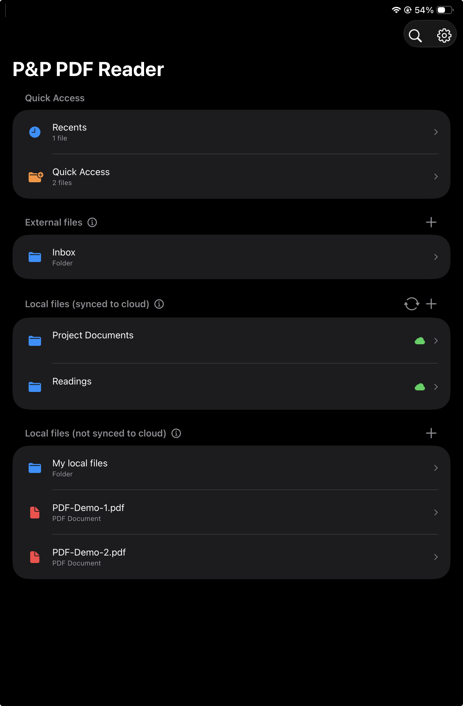
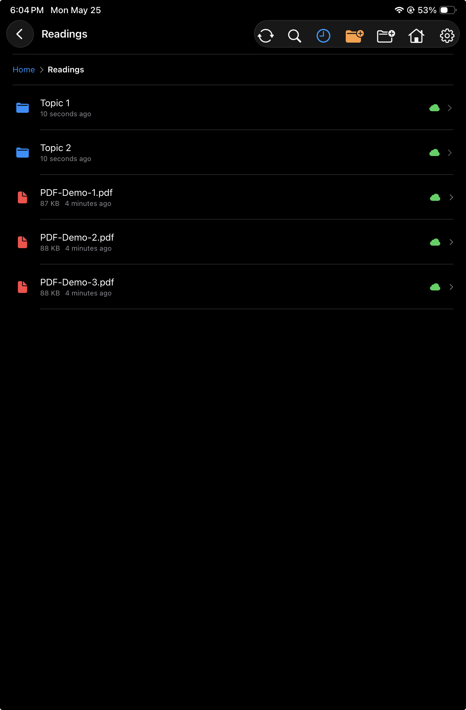
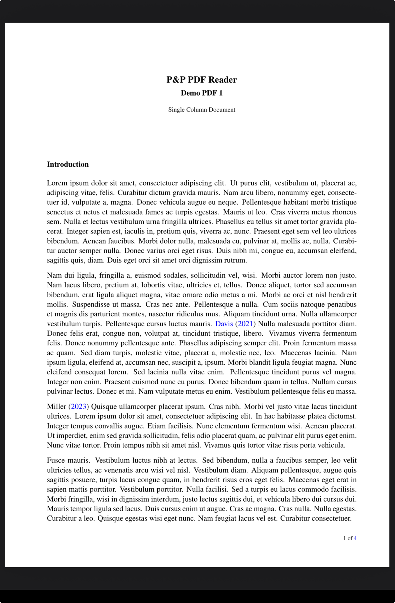
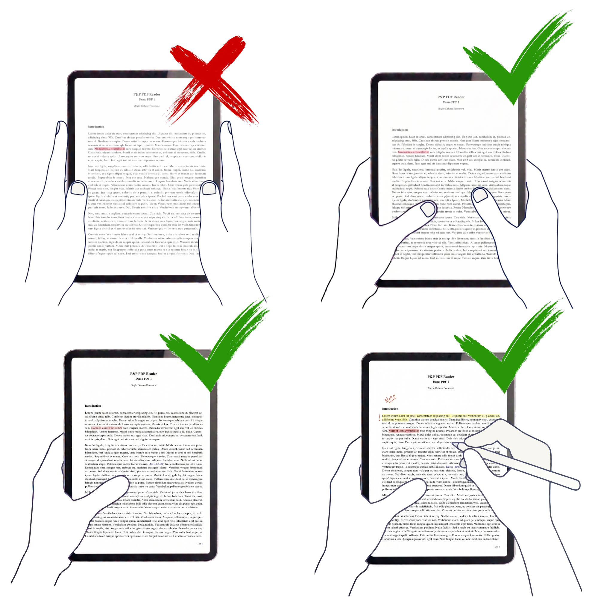

<section class="pp-page-header">
  
  

    
Explore features

    <h1>Choose the part of P&amp;P PDF Reader you want to explore.</h1>
  

</section>

<section class="pp-explore-grid" aria-label="Feature areas">
  <a class="pp-explore-card" href="../02-Home-view/" aria-label="Open Home view feature page">
    <figure>
      
    </figure>
    

      
Home view

      <h2>Import PDFs from local storage or cloud services.</h2>
      
See how the app organizes current documents, recent reading, external cloud files, and local files.

      Explore Home view
    

  </a>

  <a class="pp-explore-card" href="../03-Folder-view/" aria-label="Open Folder view feature page">
    <figure>
      
    </figure>
    

      
Folder view

      <h2>Navigate folders and manage PDFs with context menus.</h2>
      
Browse folders, open PDFs, inspect sync badges, and use long-press actions for files and folders.

      Explore Folder view
    

  </a>

  <a class="pp-explore-card" href="../01-PDF-view/" aria-label="Open Read and annotate PDFs feature page">
    <figure>
      
    </figure>
    

      
Read and annotate PDFs

      <h2>Read, write, highlight, select, and navigate inside the PDF.</h2>
      
Explore Pencil gestures, edge regions, additional finger gestures, and the full-screen reading workflow.

      Explore PDF view
    

  </a>

  <a class="pp-explore-card" href="../ergonomics/" aria-label="Open ergonomics feature page">
    <figure>
      
    </figure>
    

      
Ergonomics

      <h2>Hold the iPad naturally while reading, navigating, and annotating.</h2>
      
See how P&amp;P PDF Reader keeps touch detection compatible with book-like grips, one-handed reading, and Pencil annotation.

      Explore ergonomics
    

  </a>
</section>
