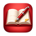
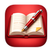

<section class="pp-page-header">
  
  

    
PDF View Feature Highlights

    <h1>Engineered to sustain deep focus and seamless reading.</h1>
  

</section>

<section class="pp-feature-list">
  <a class="pp-feature-list-card pp-feature-link" href="../touch-regions/" aria-label="Open PDF touch regions details">
    
    

      <h2>Finger touch edge regions Explore feature</h2>
      
Use dedicated touch areas in the PDF view to navigate pages, view bookmarks, open the table of contents, and more — all without touching a menu.

    

  </a>

  <a class="pp-feature-list-card pp-feature-link" href="../touch-gestures/" aria-label="Open PDF touch regions details">
    
    

      <h2>Finger touch gestures Explore feature</h2>
      
Multi-touch gestures—like a one-finger swipe, two-finger swipe, or double-tap—are readily available to trigger specific actions.

    

  </a>

  <a class="pp-feature-list-card pp-feature-link" href="../pencil-gestures/" aria-label="Open PDF touch regions details">
    
    

      <h2>Pencil annotation gesturesExplore feature</h2>
      
The Pen tool is always active and ready to write on the PDF. Long-press to highlight or select text, double tap the pencil to activate the lasso, or squeeze it to activated the eraser — no menus required.*

	  
* Squeeze gesture requires Apple Pencil Pro.

    

  </a>

  <article>
    
    

      <h2>Select and highlight text</h2>
      
Select text and highlights easily. Highlight colors can be labeled for organization. The text selection quick access menu lets you copy text, search online, translate, add links, add entries to the ToC, and use other tools.

    

  </article>

  <article>
    
    

      <h2>Natural annotation</h2>
      
Write directly on PDFs with Apple Pencil, highlight text, and keep your notes connected to your documents.

    

  </article>
  <article>
    
    

      <h2>iPad-first reading</h2>
      
The interface is designed around full-screen reading, gestures, page navigation, and minimal distractions.

    

  </article>
  <article>
    
    

      <h2>File organization</h2>
      
Organize PDFs into folders, use quick access, and manage local or synced documents.

    

  </article>
  <article>
    
    

      <h2>Cloud sync</h2>
      
Keep annotated PDFs synced while preserving a local reading experience.

    

  </article>
</section>
