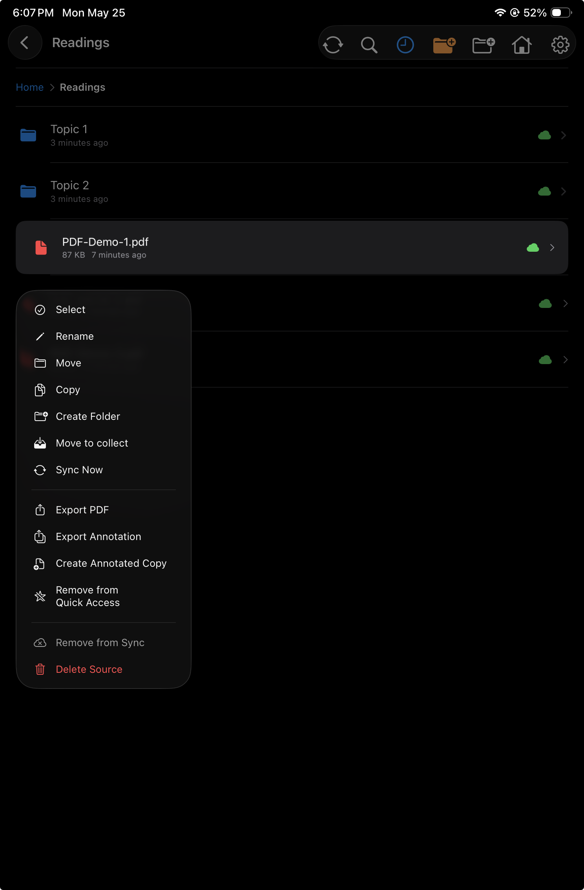
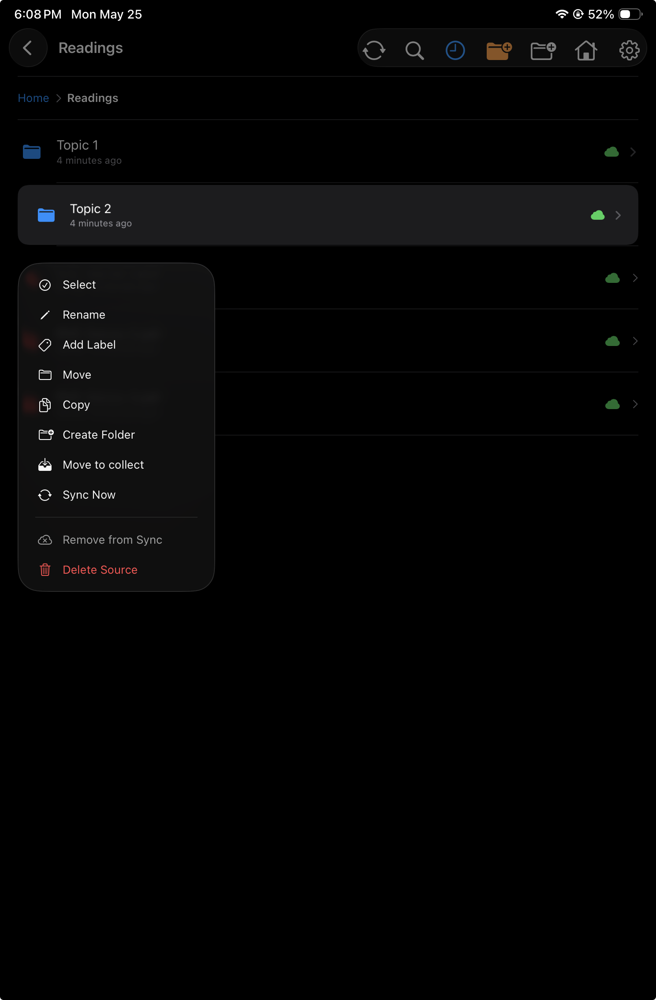

<section class="pp-page-header">
  
  

    
Folder view

    <h1>Browse folders, open PDFs, and manage file actions from context menus.</h1>
  

</section>

<section class="pp-folder-overview">
  

    
Folder navigation

    <h2>Move through document folders with a familiar file-browser layout.</h2>
    

      Folder view is built for navigating PDFs and folders. Users can open documents, move through folder hierarchies, and manage items directly from the list without leaving the app's reading workflow.
    

    

      <article>
        <h2>Folders and PDFs</h2>
        
Browse folder contents, open PDFs, and move between nested folders.

      </article>
      <article>
        <h2>Sync badges</h2>
        
Item badges indicate sync status, such as synced, pending upload, or other cloud states.

      </article>
    

  

  <figure class="pp-home-shot">
    
  </figure>
</section>

<section class="pp-folder-feature">
  

    
File actions

    <h2>Long-press a PDF to open its context menu.</h2>
    

      A long press on a PDF reveals file-level actions. This keeps common document management tools close to the file itself, while preserving the simple list view for normal browsing.
    

  

  <figure>
    
  </figure>
</section>

<section class="pp-folder-feature pp-folder-feature--reverse">
  

    
Folder actions

    <h2>Long-press a folder to manage that folder.</h2>
    

      Folder context menus expose actions for organizing folders and managing the documents inside them. The interaction is the same as files: long-press the item, then choose the action.
    

  

  <figure>
    
  </figure>
</section>

<section class="pp-storage-section">
  

    
Status at a glance

    <h2>Badges show whether documents are synced or need attention.</h2>
    

      For offline synced files, sync badges help users understand each item's cloud state while browsing. A file can show that it is synced, waiting to upload, or otherwise needs attention, so users can decide whether to open, sync, or manage it.
    

  

  

    <article>
      <h3>Synced</h3>
      
The current file or folder is up to date with its cloud copy.

    </article>
    <article>
      <h3>Needs upload</h3>
      
Local changes exist and should be synced back to the cloud.

    </article>
    <article>
      <h3>Other states</h3>
      
Badges can also communicate cloud availability or other sync-related states.

    </article>
  

</section>
