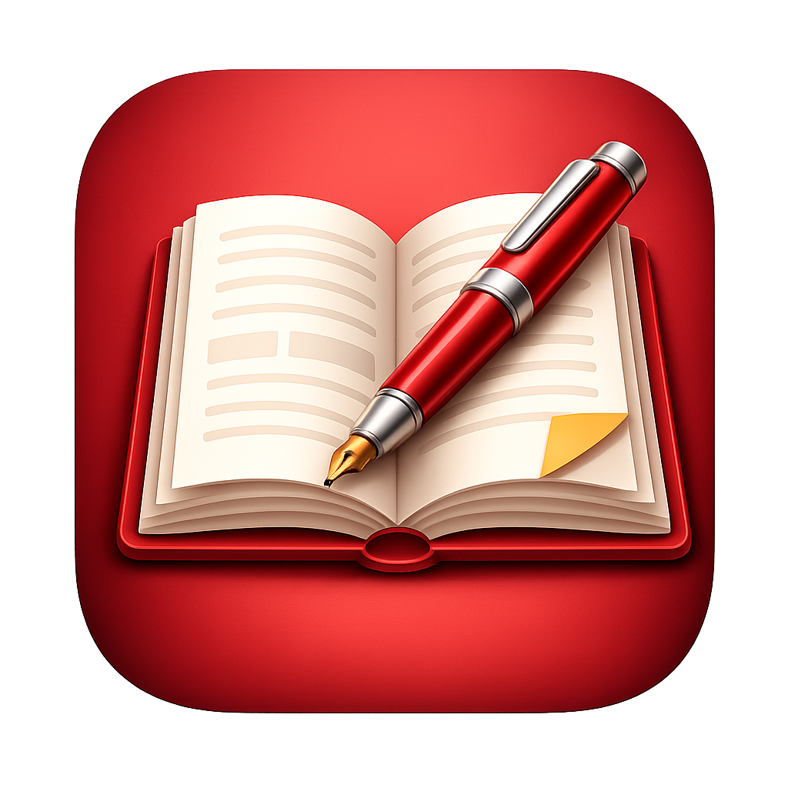
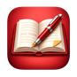
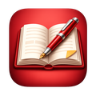
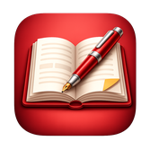

<section class="pp-hero">
  

    
iPad PDF reader and annotator

    <h1>P&amp;P PDF Reader</h1>
    

      Focus on reading PDFs, marking up key passages, and highlighting what matters.*
    

    

      <a class="md-button md-button--primary pp-store-button" href="https://apps.apple.com/app/placeholder">Download on the App Store</a>
      <a class="md-button pp-outline-button" href="00-Explore/">Explore Features</a>
      <a class="md-button pp-outline-button" href="#app-design-philosophy">App Design Philosophy</a>
      <!-- <a class="md-button pp-outline-button" href="contact/">Contact Us</a> -->
      
* Requires Apple Pencil for annotation. Apple Pencil Pro is recommended.

	 
    

  

  

    
  

</section>

<section id="reading-workflow" class="pp-section">
  
Built for focused reading

  <h2>Read and annotate PDFs with the familiar feel of paper and pencil.</h2>
  

    <article class="pp-feature-card">
      
      <h3>Paper-like ergonomics</h3>
      
Hold the tablet like a page and annotate PDFs with the familiar rhythm of paper and pencil.

    </article>
    <article class="pp-feature-card">
      
      <h3>Paper-like annotation</h3>
      
Interact with the PDF content, not app menus: annotate, highlight, and mark up with zero interface friction.

    </article>
    <article class="pp-feature-card">
      
      <h3>Fast navigation</h3>
      
Jump to pages, switch between PDFs, and move back and forth through citation links, footnotes, figures, and tables with simple gestures.

    </article>
    <article class="pp-feature-card">
      
      <h3>Reading flow and focus</h3>
      

        <!-- 
Keep only the PDF content on screen.
 -->
        <!-- 
Read without distracting menus.
 -->
        
Keep only the PDF content on screen.
        Read without distracting menus.

      

    </article>
    <article class="pp-feature-card">
      
      <h3>Annotation flow</h3>
      

        <!-- 
Pen tool is always active and ready, like a pencil on paper.
 -->
        <!-- 
Press and hold with Pencil to highlight, like a highlighter on paper.
 -->
        <!-- 
Trigger erase and lasso tools with Pencil gestures.
 -->
        
Pen tool is always active and ready, like a pencil on paper.
        Press and hold with Pencil to highlight, like a highlighter on paper.
        Trigger erase and lasso tools with Pencil gestures.

      

    </article>
    <article class="pp-feature-card">
      
      <h3>Sync to cloud</h3>
      

        <!-- 
Sync PDFs and annotations to cloud storage.
 -->
        <!-- 
Export annotations in the format you choose.
 -->
        <!-- 
Use more tools as your workflow grows.
 -->
        
Sync PDFs and annotations to cloud storage.
        Export annotations in the format you choose.
        Use more tools as your workflow grows.

      

    </article>
  

</section>

<section id="app-design-philosophy" class="pp-section">
    <h2>App Design Philosophy</h2>
  <ul class="design-principles">
    <li>Distraction-free reading</li>
    <li>Natural paper-and-pencil annotation flow</li>
    <li>Ergonomics</li>
    <li>Privacy</li>
  </ul>

The app is designed around a single central principle: <b>keeping the reader fully immersed in the PDF content.</b> Every interaction is built to preserve focus on reading and annotating — not on navigating toolbars or menus.

Traditional PDF readers often divide attention between the document and layers of toolbars, buttons, and navigation panels. Even simple actions — such as highlighting text or writing handwritten notes — frequently require interacting with menus. This constant shift of attention disrupts reading flow and reduces immersion.

This app takes a different approach: <b>interaction happens directly with the document itself.</b> The goal is to make the technology disappear, so the experience feels as immediate and focused as reading and annotating on real paper. Its interface is carefully crafted to <b>recreate the natural experience of working with paper and pencil</b>, while combining the flexibility and power of a digital workflow.

When a PDF is opened, the document becomes the entire workspace. Interface elements fade away, leaving only the content on screen. The Apple Pencil is immediately ready for annotation, allowing users to write, highlight, and sketch directly on the page without interrupting concentration or shifting attention away from the document toward navigation bars, toolbars, and menus.

Navigation through PDF pages and links is performed through simple finger gestures and configurable edge regions, allowing users to adapt interactions to their own workflow and reading habits.

The app is carefully designed to support <b>ergonomic and natural table holding while reading and annotating.</b> Gesture recognition is engineered to distinguish intentional interactions from the simple act of holding the device, allowing users to rest their thumbs naturally on the screen — as they would when holding a paper document or book — without triggering unintended actions such as page turns, zooming, or menu activation.

<b>Privacy is fundamental to the app’s design.</b> Users maintain complete ownership and control of their documents and annotations: no PDF content, handwritten notes, highlights, or personal reading data is ever collected, analyzed, or stored by the app. <b>Your documents remain yours — private and fully under your control.</b>

<b>PDFs and annotations can be securely synced through the user’s own cloud storage service</b>, keeping documents accessible and up to date across devices while ensuring users remain in full control of their data.

</section>

<section class="pp-split">
  

    
Designed for iPad

    <h2>Made for full-screen reading, handwriting, and fewer distractions.</h2>
  

  

    

      Paper & Pencil PDF Reader gives serious reading the tactile feel of a notebook while preserving the speed and flexibility of digital documents.
    

    

      <a class="md-button pp-outline-button" href="contact/">Contact Us</a>
    

  

</section>
