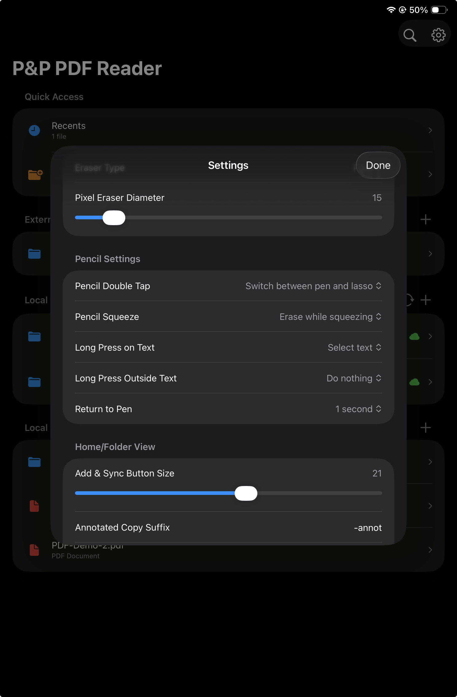
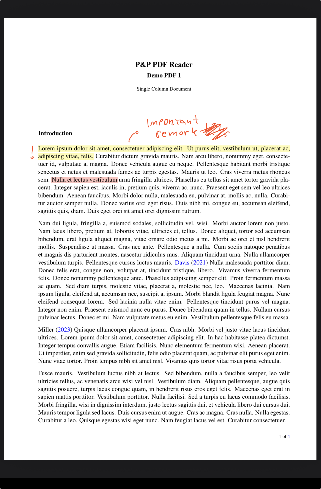
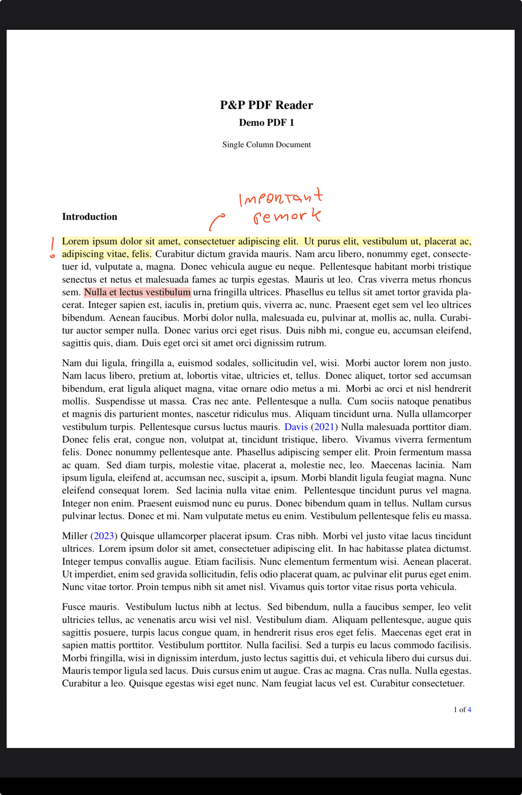
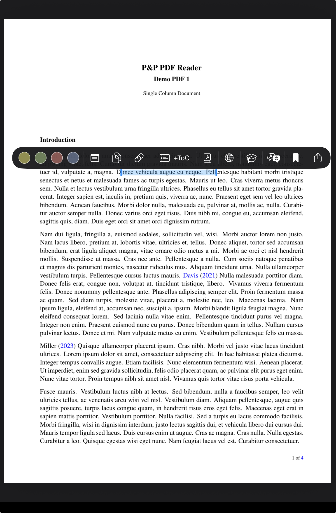
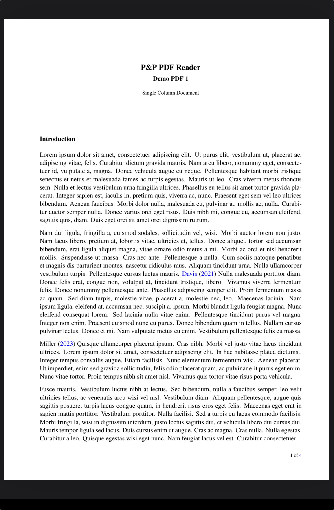
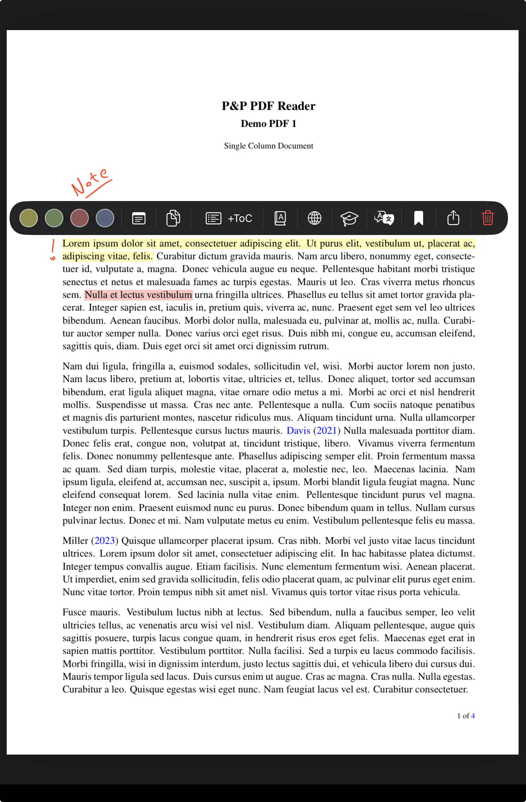
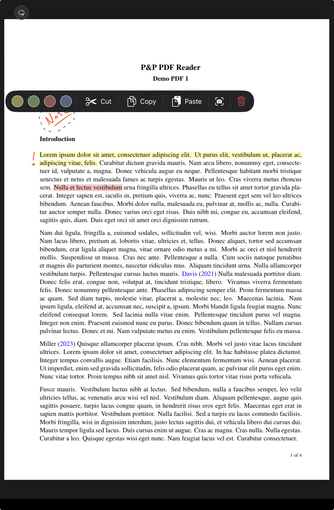
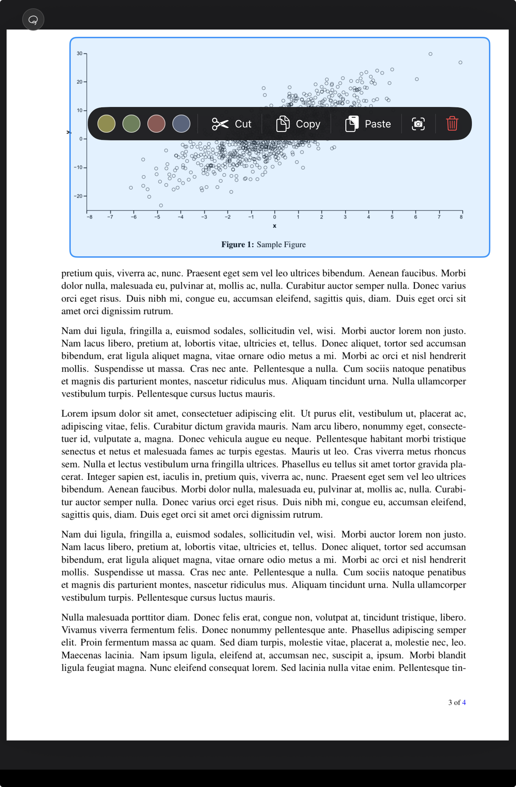

<section class="pp-page-header">
  
  

    
PDF view Pencil gestures

    <h1>Write, highlight, select, and erase with simple Apple Pencil gestures.</h1>
  

</section>

<section class="pp-touch-config pp-pencil-basics">
  <article>
    <h2>Pen always active</h2>
    
Start handwriting naturally on the PDF, without first choosing a tool.

  </article>
  <article>
    <h2>Double-tap to switch</h2>
    
Double-tap Apple Pencil to switch from pen to lasso. In Settings, this can be changed to switch to eraser instead.

  </article>
  <article>
    <h2>Squeeze to erase</h2>
    
With Apple Pencil Pro, squeeze to erase while squeezing. The squeeze gesture is configurable in Settings.

  </article>
  <article>
    <h2>Configurable behavior</h2>
    
Settings include gesture actions, return-to-pen timing, highlighting behavior, eraser behavior, and more.

  </article>
</section>

<section class="pp-pencil-hero">
  

    
Pencil settings

    <h2>Simple defaults, with room for personal workflow.</h2>
    

      Pencil gestures are designed to keep annotation direct: write with the pen, briefly switch tools with Pencil gestures, and let the app return to the pen automatically when configured.
    

    

      <article>
        <strong>Auto return to pen</strong>
        Choose a timer so lasso or eraser can fall back to pen after a gesture-driven action.
      </article>
      <article>
        <strong>Highlight or select</strong>
        Choose what a Pencil long-press on text should do first.
      </article>
      <article>
        <strong>Lasso or eraser</strong>
        Use double-tap or squeeze for the tool behavior that feels most natural.
      </article>
    

  

  <figure class="pp-pencil-phone">
    
  </figure>
</section>

<section class="pp-section">
  
Pen handwriting annotations

  <h2>Start writing. Scratch out strokes when you want to erase.</h2>
  

    The pen is always ready, so writing feels immediate. Users can also configure a timer that returns the Pencil to the pen after lasso or eraser is activated with a Pencil gesture.
  

  

    <figure>
      
      <figcaption>Write naturally on the PDF.</figcaption>
    </figure>
    <figure>
      
      <figcaption>Scratch across strokes to remove them.</figcaption>
    </figure>
    <figure>
      
      <figcaption>The scratched strokes disappear.</figcaption>
    </figure>
  

</section>

<section class="pp-pencil-feature">
  

    
Text selection

    <h2>Long-press with Pencil to select text and open the context menu.</h2>
    

      When long-press with Pencil is assigned to text selection in Settings, the selection context menu opens automatically. Options include highlighting the selected text, adding a note, copying the selection, creating a link in the selected text to a URL or another PDF page, searching Google or Google Scholar, adding an entry to the ToC, translating, looking up, or bookmarking.
    

    

      When a link is created, a blue underline marks the linked text. The link can then be followed with a two-finger tap. Created links work inside the app, but may not work in exported or external PDF files.
    

  

  

    <figure>
      
      <figcaption>Selection opens the full context menu.</figcaption>
    </figure>
    <figure>
      
      <figcaption>Created links are marked with a blue underline.</figcaption>
    </figure>
  

</section>

<section class="pp-pencil-feature">
  

    
Highlight text

    <h2>Long-press text with Pencil to highlight or select.</h2>
    

      A Pencil long-press on text starts highlighting or text selection, depending on the setting. Tapping an existing highlight with Pencil opens the highlight context menu for quick actions.
    

  

  <figure>
    
  </figure>
</section>

<section class="pp-pencil-feature pp-pencil-feature--reverse">
  

    
Free lasso

    <h2>Double-tap Pencil to select handwritten strokes.</h2>
    

      Double-tap Apple Pencil to switch from pen to lasso. Draw around pen strokes to select them, then tap the selection to open the lasso context menu.
    

  

  <figure>
    
  </figure>
</section>

<section class="pp-pencil-feature">
  

    
Rectangular lasso

    <h2>Long-press with lasso active to start a rectangular selection.</h2>
    

      When the lasso tool is active, long-press to begin a rectangular lasso. Tap the selected region to open the context menu for the selected content.
    

  

  <figure>
    
  </figure>
</section>

<section class="pp-split">
  

    
Eraser

    <h2>Erase only while the squeeze is active.</h2>
  

  

    With Apple Pencil Pro, squeezing can temporarily activate the eraser and release back to the previous flow. Like the other Pencil gestures, this behavior can be configured in Settings.
  

</section>
