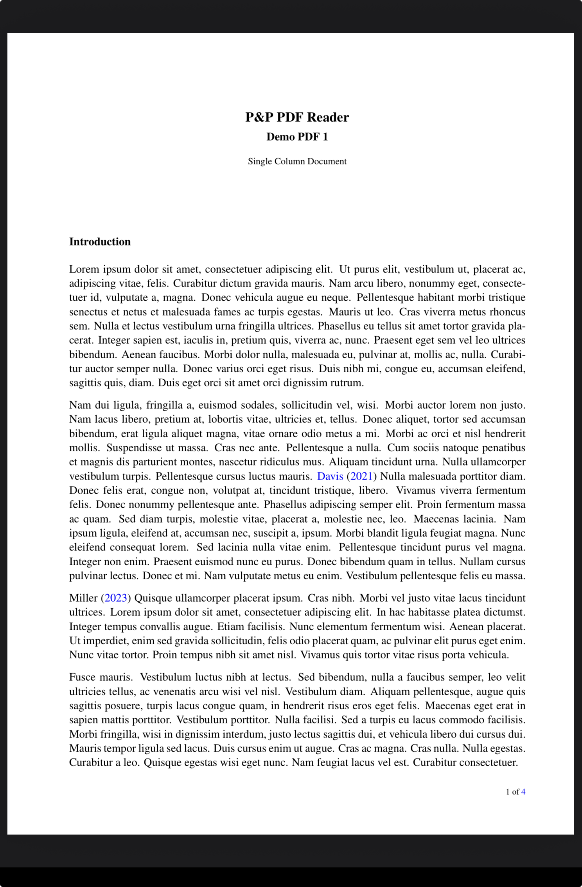
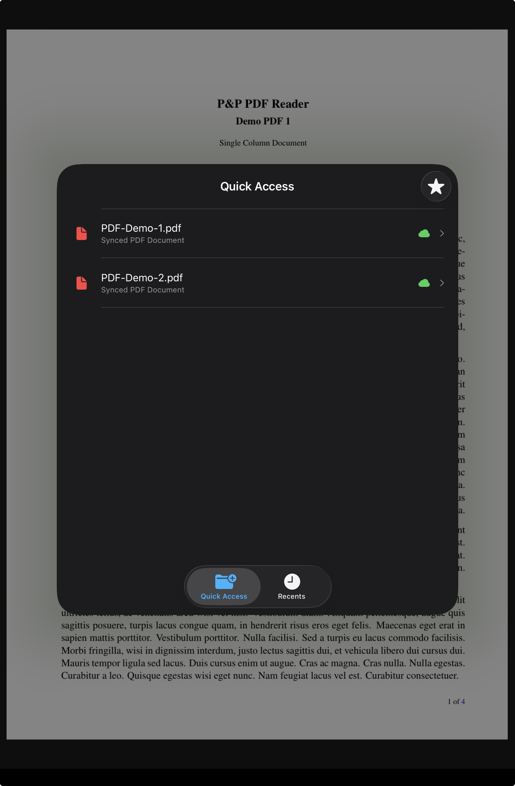
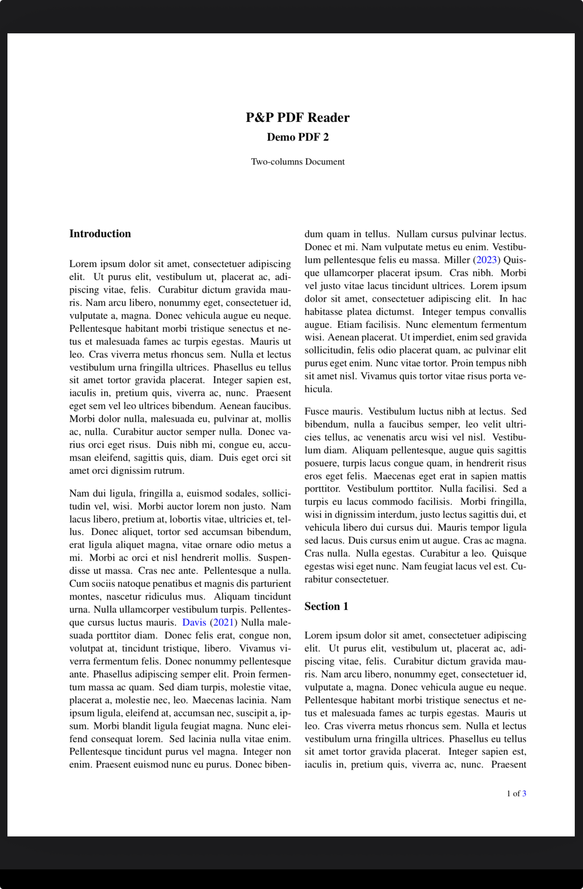

<section class="pp-page-header">
  
  

    
Quick PDF switching

    <h1>Switch between the current PDF and nearby documents without leaving the PDF view.</h1>
  

</section>

<section class="pp-touch-config">
  <article>
    <h2>Stay in PDF view</h2>
    
Open Quick Access and Recent PDFs over the current document instead of returning to Home or Folder view.

  </article>
  <article>
    <h2>Default shortcut</h2>
    
Long-press region R5, the top-right edge region, to show Quick Access and Recent files.

  </article>
  <article>
    <h2>Select a PDF</h2>
    
Choose the document you want to inspect, compare, cite, or continue reading.

  </article>
  <article>
    <h2>Jump back</h2>
    
Swipe right with two fingers to return to the original PDF through navigation history.

  </article>
</section>

<section class="pp-section">
  
Default workflow

  <h2>Move to another PDF, then return with one gesture.</h2>
  

    Quick switching is useful when a reading session involves more than one document. With the default actions, region R5 opens nearby PDFs and the two-finger right swipe brings the user back to the original PDF.
  

  

    <figure>
      
      <figcaption>Long-press R5 in the top-right edge region.</figcaption>
    </figure>
    <figure>
      
      <figcaption>Select a PDF from Quick Access or Recents.</figcaption>
    </figure>
    <figure>
      
      <figcaption>Swipe right with two fingers to jump back.</figcaption>
    </figure>
  

</section>

<section class="pp-split">
  

    
Why it helps

    <h2>Reference another document without losing your place.</h2>
  

  

    The current PDF stays part of the navigation flow. After checking a Quick Access or Recent PDF, the default two-finger right swipe returns to the original document so comparison and cross-reading stay fast.
  

</section>
