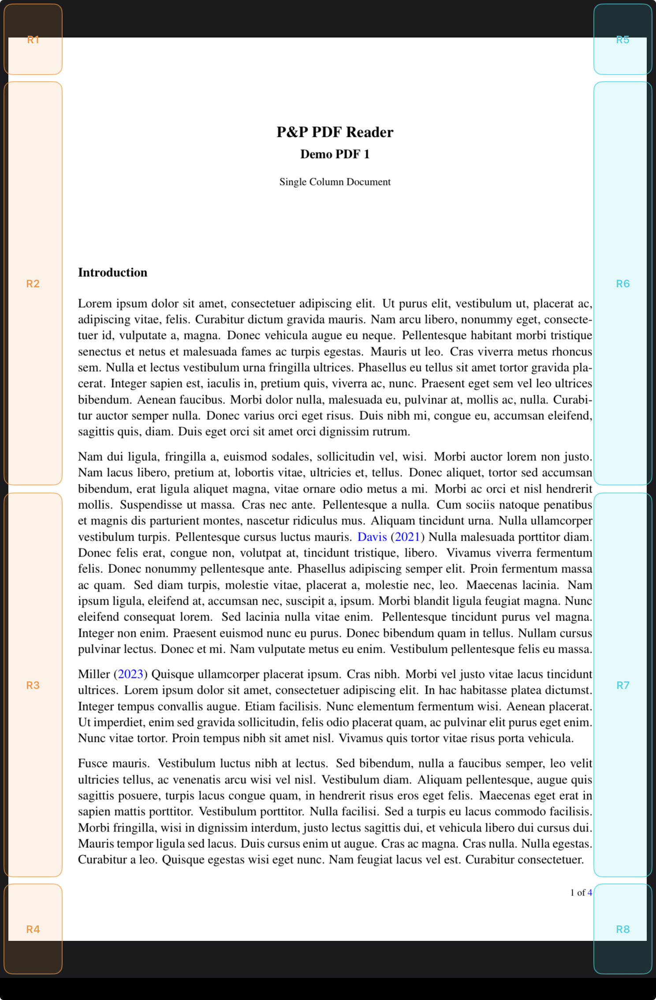

<section class="pp-page-header">
  
  

    
PDF touch regions

    <h1>Tap the page edges without leaving your reading posture.</h1>
  

</section>

<section class="pp-touch-config">
  <article>
    <h2>Configurable actions</h2>
    
Every touch region can be assigned the action that best fits your reading workflow.

  </article>
  <article>
    <h2>Three gestures per region</h2>
    
Each region accepts tap, long press, and double tap, with one action configured for each gesture.

  </article>
  <article>
    <h2>Adjustable region size</h2>
    
Region sizes are configurable, so the page edges can match your grip, hand size, and reading posture.

  </article>
  <article>
    <h2>Invisible while reading</h2>
    
Touch regions are transparent during normal use. Show them only when configuring region sizes.

  </article>
</section>

<section class="pp-touch-layout">
  <figure class="pp-touch-figure">
    
  </figure>

  

    
By default, the eight regions work as paired left and right controls:

    

      <article>
        <h2>R1</h2>
        

          
<strong>Tap:</strong> Back to folder

          
<strong>Double tap:</strong> Back to Home

          
<strong>Long press:</strong> Show ToC

        

      </article>
      <article>
        <h2>R5</h2>
        

          
<strong>Tap:</strong> Bookmarks

          
<strong>Double tap:</strong> Show Settings

          
<strong>Long press:</strong> Show Quick Access Files

        

      </article>
      <article>
        <h2>R2</h2>
        

          
<strong>Tap:</strong> Previous Page

          
<strong>Double tap:</strong> First page

          
<strong>Long press:</strong> Do nothing

        

      </article>
      <article>
        <h2>R6</h2>
        

          
<strong>Tap:</strong> Next Page

          
<strong>Double tap:</strong> Last page

          
<strong>Long press:</strong> Do Nothing

        

      </article>
      <article>
        <h2>R3</h2>
        

          
<strong>Tap:</strong> Previous Page

          
<strong>Double tap:</strong> First page

          
<strong>Long press:</strong> Do nothing

        

      </article>
      <article>
        <h2>R7</h2>
        

          
<strong>Tap:</strong> Next Page

          
<strong>Double tap:</strong> Last page

          
<strong>Long press:</strong> Do Nothing

        

      </article>
      <article>
        <h2>R4</h2>
        

          
<strong>Tap:</strong> Search Word

          
<strong>Double tap:</strong> Crop to text

          
<strong>Long press:</strong> Ask Action

        

      </article>
      <article>
        <h2>R8</h2>
        

          
<strong>Tap:</strong> End of PDF

          
<strong>Double tap:</strong> Show thumbnails

          
<strong>Long press:</strong> Sync file

        

      </article>
    

  

</section>

<section class="pp-split">
  

    
How it helps

    <h2>Keep the document under your hands, like paper.</h2>
  

  

    The touch regions make common navigation targets available from the page margins, so you can read, highlight, and annotate without reaching for toolbars or breaking concentration.
  

</section>
