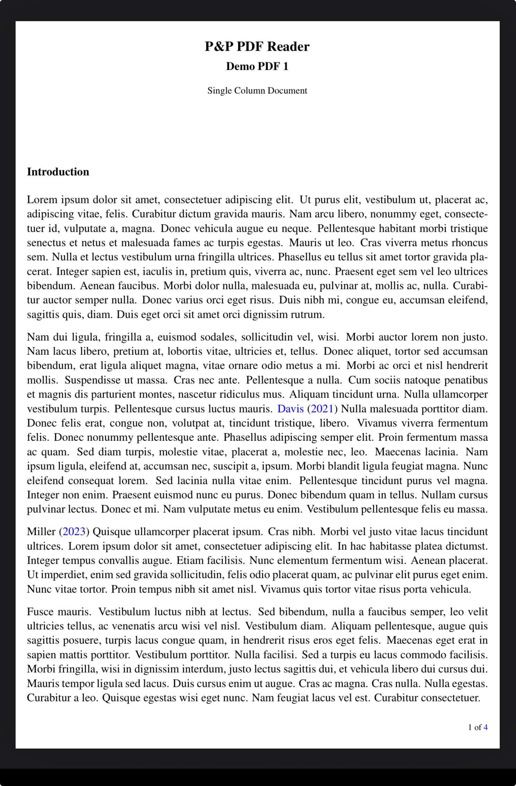
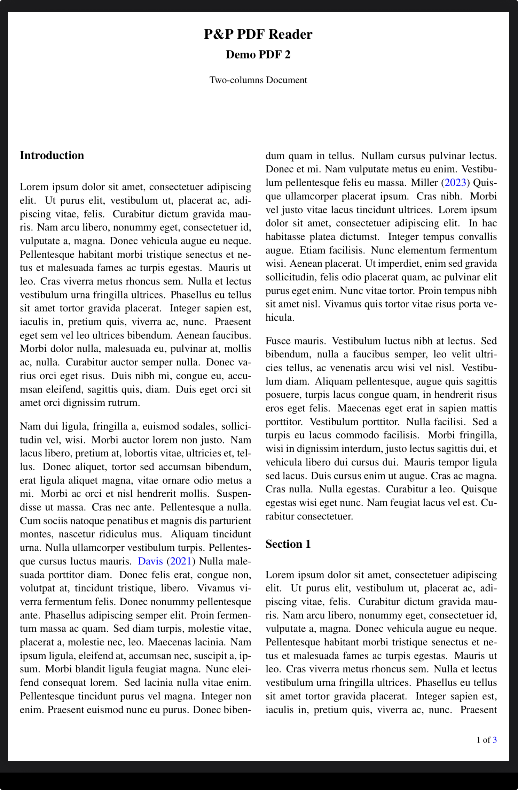
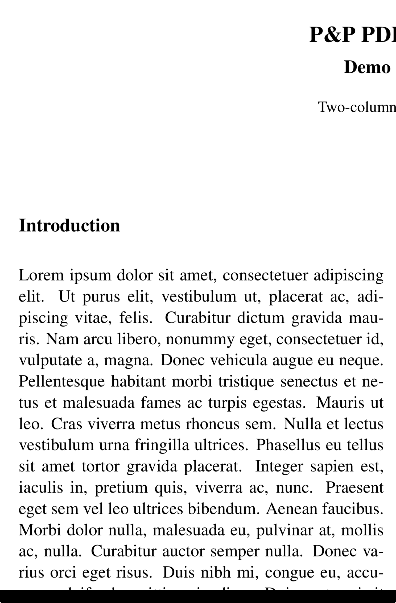
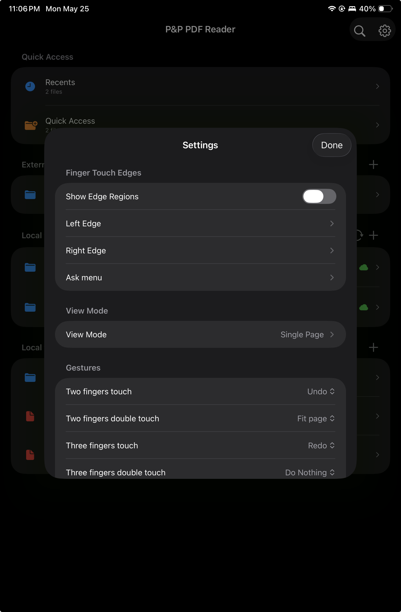
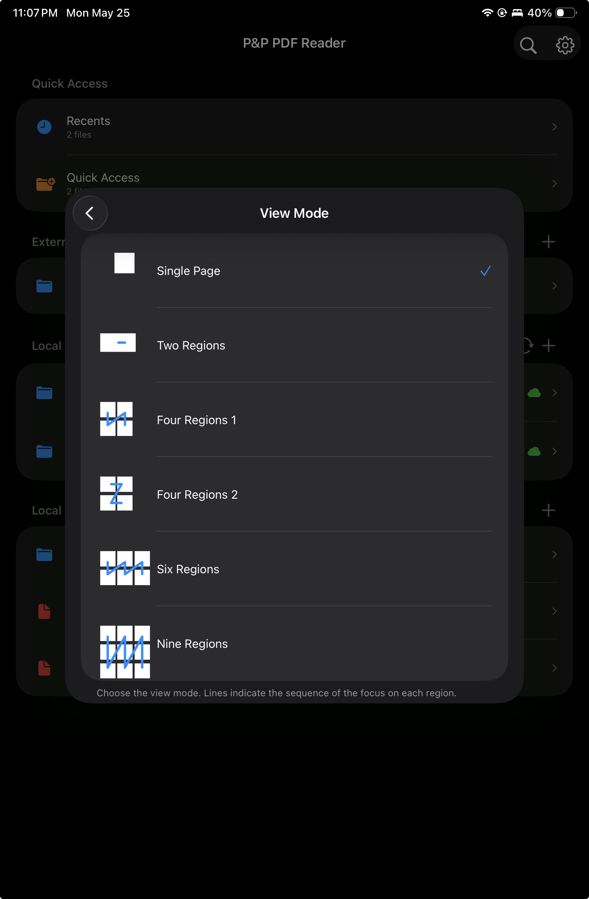
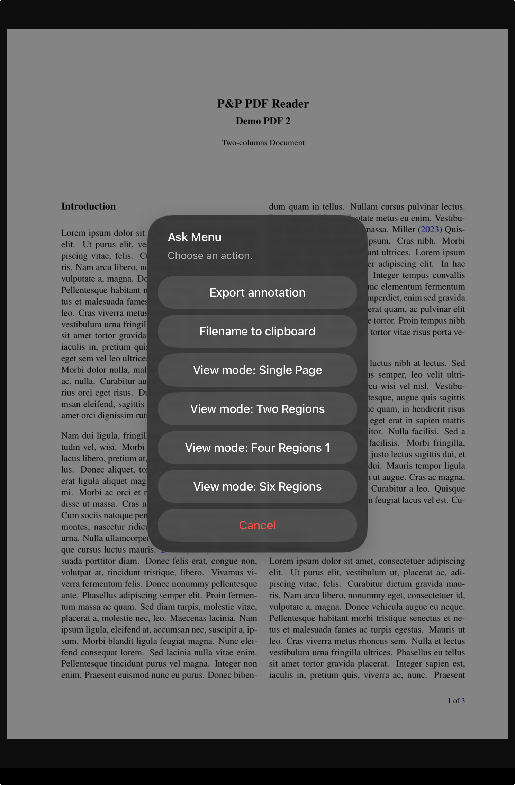

<section class="pp-page-header">
  
  

    
PDF reading layout

    <h1>Crop blank margins and choose a view mode for dense PDF pages.</h1>
  

</section>

<section class="pp-touch-config pp-view-mode-basics">
  <article>
    <h2>Crop to text</h2>
    
Temporarily omits blank margin space while reading, keeping the text larger and closer to the hand.

  </article>
  <article>
    <h2>Default gesture</h2>
    
Double-tap edge region R4, the lower-left edge region, to toggle crop to text while reading.

  </article>
  <article>
    <h2>View mode</h2>
    
Partition the screen into four or six reading regions to move through two-column or three-column PDFs comfortably.

  </article>
  <article>
    <h2>R4 shortcut</h2>
    
Long-press region R4 to choose the PDF view mode from the edge-region ask menu.

  </article>
</section>

<section class="pp-split">
  

    
Reading comfort

    <h2>Temporary layout changes, no PDF edits required.</h2>
  

  

    Crop to text and view mode are reading conveniences. They change how the page is presented in the app, helping the user focus on the content without altering the PDF document itself.
  

</section>

<section class="pp-view-mode-feature">
  

    
Crop to text

    <h2>Use the page area for the words, not the blank margins.</h2>
    

      Crop to text temporarily removes empty PDF margins from the reading view. The PDF file itself is not changed; the app simply uses the available screen area more efficiently while the user reads.
    

    

      By default, crop to text is toggled with a double tap on region R4, the lower-left edge region. This keeps the adjustment close to the reading hand and avoids opening menus.
    

  

  

    <figure>
      
      <figcaption>Before crop to text.</figcaption>
    </figure>
    <figure>
      
      <figcaption>After crop to text.</figcaption>
    </figure>
  

</section>

<section class="pp-view-mode-feature pp-view-mode-feature--reverse">
  

    
Change PDF View Mode

    <h2>Split the reading flow into four or six regions.</h2>
    

      View mode helps with academic PDFs, articles, and books that use multiple columns. Instead of treating the whole page as one reading area, the app can divide the screen into four regions for two-column PDFs or six regions for three-column PDFs.
    

    

      The result is a steadier reading rhythm: move through each region in order, keep the text large, and avoid constant manual zooming or panning.
    

  

  

    <figure>
      
      <figcaption>Two-column PDF in regular view.</figcaption>
    </figure>
    <figure>
      
      <figcaption>Four-region mode for a two-column PDF.</figcaption>
    </figure>
  

</section>

<section class="pp-section">
  
Settings and edge-region access

  <h2>Choose the view mode from Settings or directly from R4.</h2>
  

    View mode can be configured in Settings, and region R4 can open an ask menu for quickly changing the PDF view mode while reading.
  

  

    <figure>
      
      <figcaption>View Mode appears in Settings.</figcaption>
    </figure>
    <figure>
      
      <figcaption>Select the preferred view mode.</figcaption>
    </figure>
    <figure>
      
      <figcaption>Use the R4 edge-region ask menu.</figcaption>
    </figure>
  

</section>
